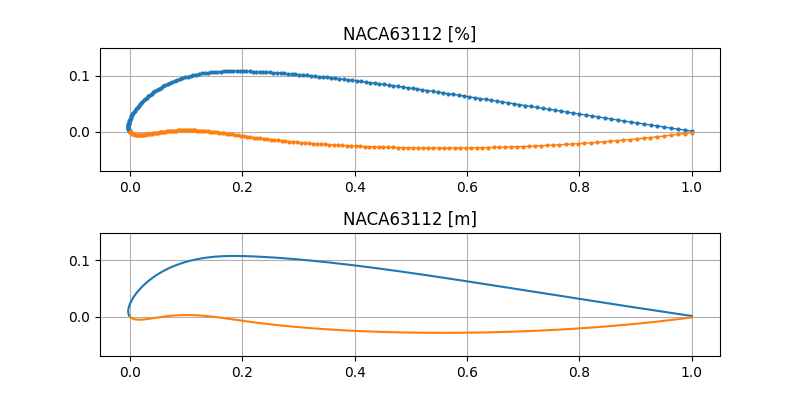

# Kalkulator profili lotniczych z serii NACA 4 i 5 cyfrowych

---

## Opis
Program służy do obliczania współczynników profili lotniczych z serii NACA 4 i 5 cyfrowych.
Pogram rysuje wykres profilu, oraz generuje plik z danymi współrzędnych profilu dla programu Xfoil.

## Konfiguracja
- W lini 13 wartość zmiennej `NACA` należy zmienić na numer profilu, który chcemy obliczyć
- W lini 14 wartość zmiennej `length` należy zmienić na długość profilu, którą chcemy obliczyć
- W lini 15 wartość zmiennej `f` należy zmienić na wartość `f` profilu, którą chcemy obliczyć

## Przykład 
**Profilu NACA63112, o długości 1m i wartości f 0.29**

